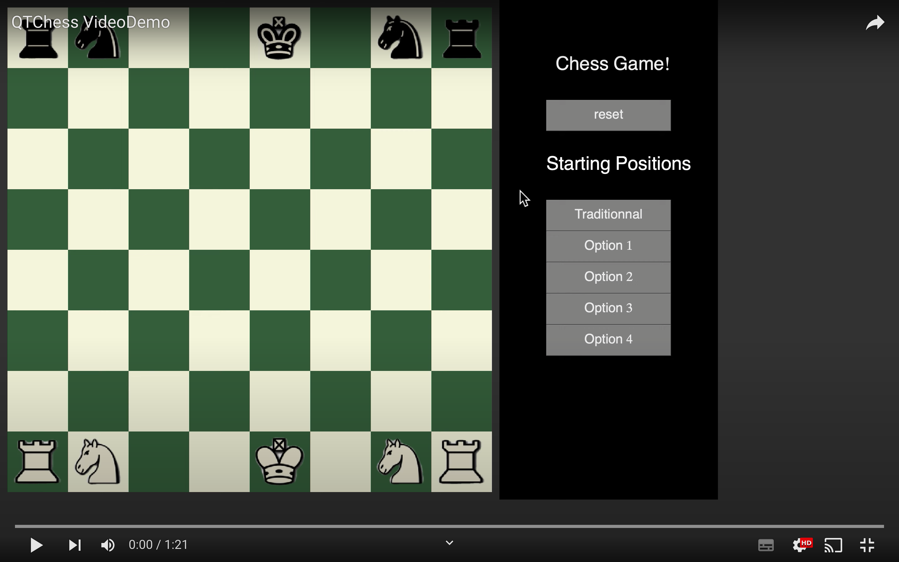

# QTChess Project

## Table of contents
1. [Introduction](#introduction)  
1.1 [video demo](#video-demo)
2. [Technologies in this project](#technologies)
3. [Contact](#contact)

## Introduction

This chess game was made entirely in C++ with the help of the QT framework. The code was all written using the famous Object Oriented Programming(OOP) paradigm.

### Video Demo

This chess game project was made in the context of a school team project. It was built at the end of our first year as software engineering students of Polytechnique Montreal.

## Technologies

- language : [C++](https://fr.wikipedia.org/wiki/C%2B%2B)
- Graphics framework : [QT](https://fr.wikipedia.org/wiki/Qt)

## Contact

[LinkedIn](https://www.linkedin.com/in/s%C3%A9bastien-roy-611245213/)

